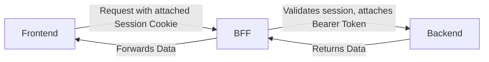

Date: 2025-06-23
Tags: [[security]], [[architecture]]

With BFF right in front of the backend, frontend can identify a client with a cookie say its session ID, while BFF maps this session ID to a Bearer token, for example, hiding this secret.

Related:
- [[Cookies has security points]]