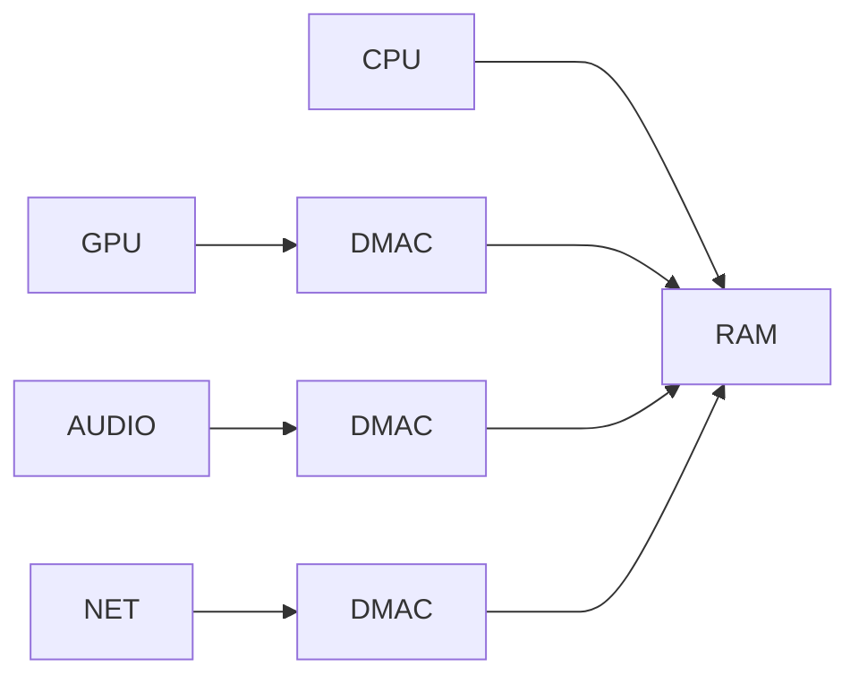

Date: 2025-03-25
Tags: [[low-level]]

To GPU and RAM communication between themself, they suppose to need to pass through CPU. But not. They go through DMAC, which communicates to the RAM without needing CPU.

That's one of the reasons why nowadays CPU has cache. Instead of competing with peripherical DMAC the RAM access. CPU access to cache first and only when cache is missing, then CPU fetches from the RAM.

## Literature
[[Video - How Peripheral devices transfer data to RAM]]