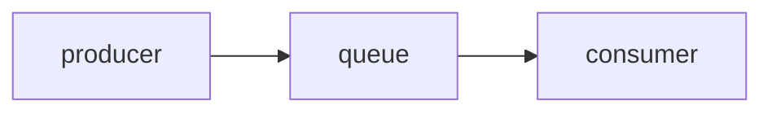

Date: 2025-03-27
Tags: [[performance]]

The context is, you have fast producer, in terms of CPU usage, and slow customer. 

When you front a spike, unexpected amount of requests in short period of time, the first message to be produced and then consumed may take a while, and this could disturb producer to enqueue new messages.

Slowing down the message consumer by *delaying message delivery*, you can enqueue all spiked messages, and then consume one by one.
