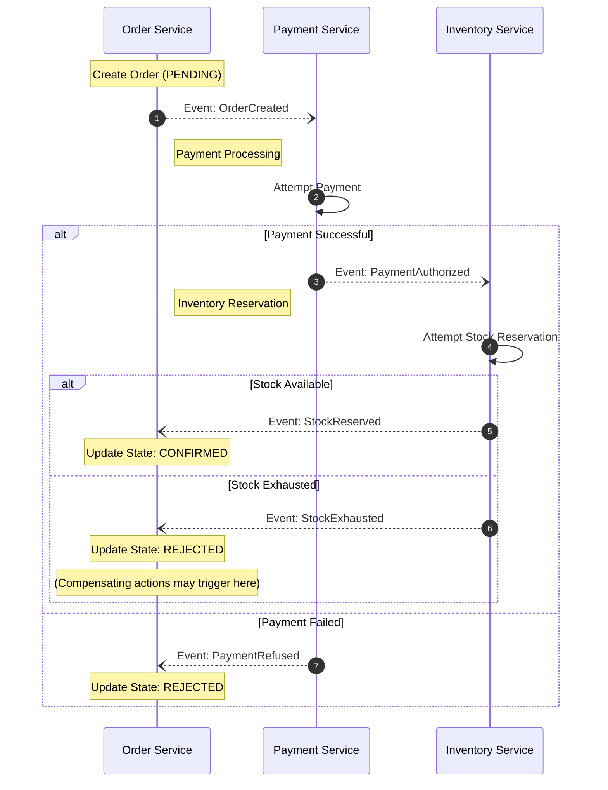

Date: 2026-01-30
Tags: [[patterns]], [[distributed systems]]

Pros:
- Distributed ledger: services are totally independent
Cons:
- Bad traceability
- Distributed coupling between services

```mermaid
sequenceDiagram
    autonumber
    participant O as Order Service
    participant P as Payment Service
    participant I as Inventory Service

    Note over O: Create Order (PENDING)
    O--)P: Event: OrderCreated

    rect  rgb(255, 255, 255)
        note right of O: Payment Processing
        P->>P: Attempt Payment
        
        alt Payment Successful
            P--)I: Event: PaymentAuthorized
            
            note right of O: Inventory Reservation
            I->>I: Attempt Stock Reservation
            
            alt Stock Available
                I--)O: Event: StockReserved
                Note over O: Update State: CONFIRMED
            else Stock Exhausted
                I--)O: Event: StockExhausted
                Note over O: Update State: REJECTED
                Note over O: (Compensating actions may trigger here)
            end

        else Payment Failed
            P--)O: Event: PaymentRefused
            Note over O: Update State: REJECTED
        end
    end
```