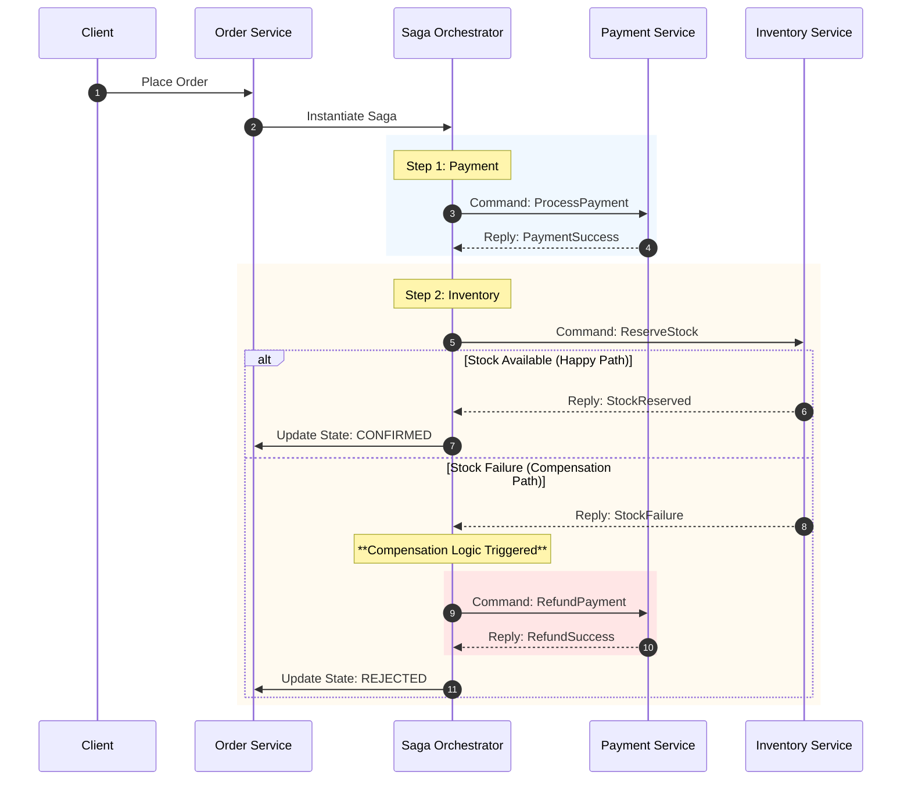

Date: 2026-01-30
Tags: [[patterns]], [[distributed systems]]

Orchestration
Pros:
- Easy to trace: a single orchestration 
- Dump services: Order service just process, they don't know what is that
Cons:
- Single point of failure

The Saga Orchestration could be **standalone**, or **embedded** on the Order Service.

