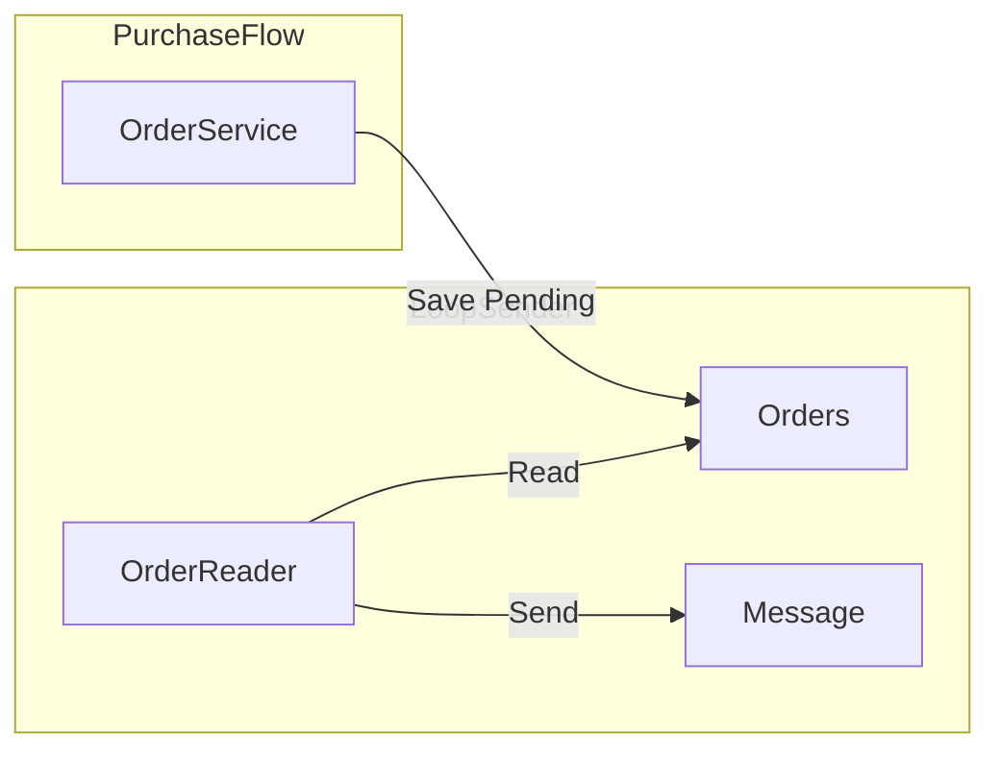
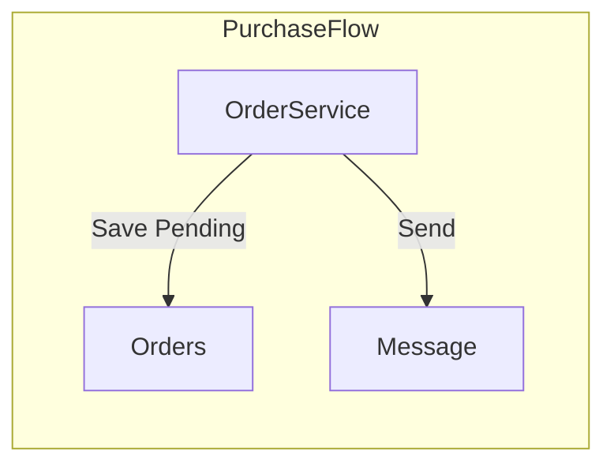

Date: 2025-04-09
Tags: [[scalability]], [[patterns]]

Overview

Transaction outbox works:
- Producer save the message to be sent in the table
- Reader reads messages in a loop, then sent it

A simplest approach could be also

[[KISS]] with some tradeoff:
- If send fails, you need to send message manually

## Literature
[[Article - Pattern Transactional outbox]]
[[Article - This One Kafka Design Pattern Changed Everything for Us]]